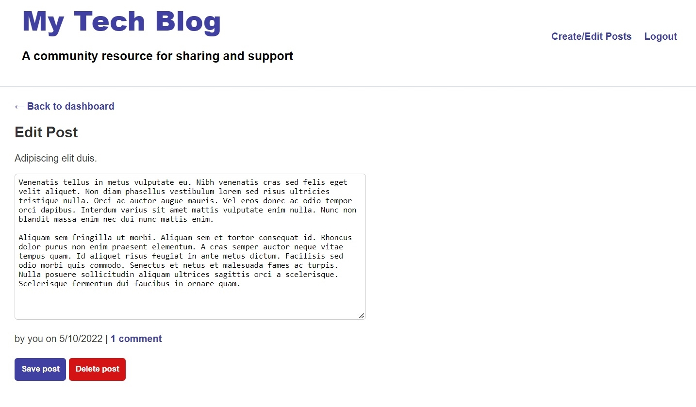

# Model View Controller Challenge
My Tech Blog

## Description

This is a a CMS-style blog site where developers can publish their blog posts as well as comment on other developers’ posts. This app was designed using Handlebars.js as the templating language, Sequelize as the ORM, and the express-session npm package for authentication.

Any visitor to the site is able to read any existing comments and posts. In order to contribute to the blog, the user must sign up for access with their user name, email address and password. Once a user is logged in, they are able to either write and save new posts, comment on their own or other users' posts, or edit and update their existing posts.

## Table of Contents

- [Project Title](#model-view-controller-challenge)
- [Description](#description)
- [Installation](#installation)
- [Usage](#usage)
- [License](#license)
- [Contribute](#contribute)

## Installation

No installation is necessary to use this blog.

## Usage

The application will be accessed on [Heroku](https://vast-retreat-56834.herokuapp.com/).

## License

This application is covered under [The MIT License](https://opensource.org/licenses/MIT).

## Contribute

This project has adopted the [Contributor Covenant](https://www.contributor-covenant.org/).

## Questions

GitHub:
<https://github.com/EvelynAguirreOrtiz>

Project URL:
https://github.com/EvelynAguirreOrtiz/model-view-controller-challenge-utsa-bc-05-2022.git

Please send requests for additional information to:
<evelyn.aguirre.9895@gmail.com>

